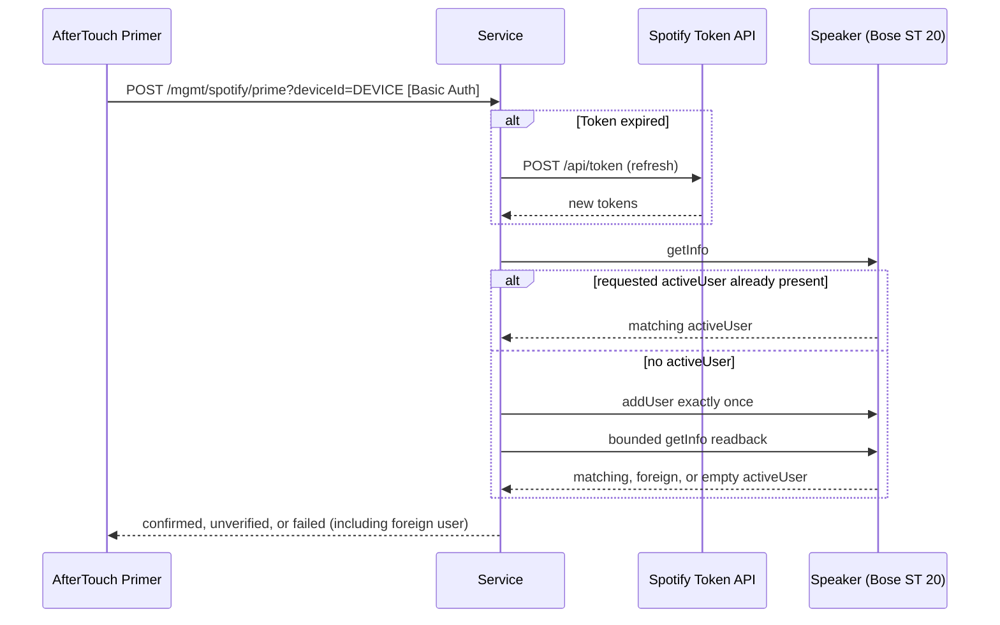

> **New here?** Start with [spotify-overview.md](spotify-overview.md) for the
> mental model (Spotify Connect vs OAuth-intercept, DNS rewrite gotcha,
> end-to-end token lifecycle). This document zooms in on the OAuth flows and
> management endpoints.

The SoundTouch service supports Spotify OAuth integration to broker access
tokens for SoundTouch speakers. This maintains Spotify Connect functionality
after Bose shut down its SoundTouch cloud in May 2026.

## OAuth Flow

The service supports an account-bound browser flow. Native-app deep-link
authorization is intentionally not part of this flow: the callback must return
through the same browser session that opened the single-use local bootstrap
URL.

### Browser-based Flow

The user initiates the flow, completes authorization in their browser, and is redirected back to the service.

```mermaid
sequenceDiagram
    participant Client as Client (curl/app)
    participant Service as Service
    participant Spotify as Spotify Auth Server
    participant Browser as User's Browser

    Client->>Service: POST /mgmt/spotify/init?account=ACCOUNT [Basic Auth]
    Service-->>Client: {"redirectUrl": "https://aftertouch.example/mgmt/spotify/start?state=RANDOM&session=NONCE"}
    
    Client->>Browser: User opens URL
    Browser->>Service: GET /mgmt/spotify/start?state=RANDOM&session=NONCE
    Service-->>Browser: Set HttpOnly session cookie; redirect to Spotify
    Browser->>Spotify: User logs in & grants access
    Spotify-->>Browser: Redirect to /mgmt/spotify/callback?code=abc&state=RANDOM
    
    Browser->>Service: GET callback with state and session cookie
    Note over Service: Consume state and browser session exactly once
    
    Service->>Spotify: POST /api/token (exchange code)
    Spotify-->>Service: {access_token, refresh_token}
    
    Service->>Spotify: GET /v1/me (fetch profile)
    Spotify-->>Service: {id, display_name, email}
    
    Note over Service: Atomically store exact Spotify identity and bind it only to ACCOUNT
    
    Service-->>Browser: HTML: "Spotify Connected. You can close this window."
```

`/mgmt/spotify/confirm` remains as an authenticated compatibility completion
endpoint, but it requires the same browser-session cookie and state as the
normal callback. It is not a bearer-code export or a standalone native-app
deep-link flow.

### Speaker Token Brokerage and Priming

Management clients cannot export Spotify access tokens. AfterTouch resolves one
configured device to one Marge account and one Spotify source, refreshes that
exact identity if necessary, and returns an access token only through the
speaker-facing broker after its source-specific surrogate secret is verified.



## Priming Speakers

> **Note:** The on-device boot-primer flow (installing `spotify-boot-primer.sh` onto the speaker's `/mnt/nv` and hooking it from `rc.local`) is **deprecated**. AfterTouch now uses a server-centric model: the service registers a `SPOTIFY` source in marge for the device's paired account and pushes credentials via ZeroConf from the server side, triggered on `power_on` and a manual "Prime" action. See [spotify-priming-strategy.md](spotify-priming-strategy.md) for the current model and rationale.
>
> The artifacts under `scripts/spotify/` are kept as historical reference for users who still rely on the on-device approach. There is no longer a `/mgmt/devices/{deviceId}/spotify/install-primer` endpoint.

## Endpoints

| Method | Path                                              | Auth  | Purpose                                                               |
|--------|---------------------------------------------------|-------|-----------------------------------------------------------------------|
| POST   | `/mgmt/spotify/init?account=...`                  | Basic | Start an account-bound, single-use OAuth transaction                  |
| GET    | `/mgmt/spotify/start`                             | Nonce | Set the browser-bound cookie and redirect to Spotify                  |
| GET    | `/mgmt/spotify/callback`                          | Cookie | Browser OAuth callback (redirect from Spotify, returns HTML)         |
| POST   | `/mgmt/spotify/confirm?code=...&state=...`        | Basic + cookie | Compatibility completion of the same browser transaction   |
| GET    | `/mgmt/spotify/accounts`                          | Basic | List linked Spotify accounts (tokens stripped)                        |
| GET    | `/mgmt/spotify/token`                             | Basic | Removed token-export endpoint; returns `410 Gone`                     |
| POST   | `/mgmt/spotify/entity`                            | Basic | Resolve a URI using the explicit Spotify `account` in the JSON body   |
| POST   | `/mgmt/spotify/prime`                             | Basic | Manually trigger server-side priming of a discovered speaker          |

## Security

- `/mgmt/spotify/start` and `/mgmt/spotify/callback` are outside Basic Auth so
  browser redirects work, but both require transaction-specific proof. The
  bootstrap nonce is single-use and the callback requires its HttpOnly cookie.
- All other `/mgmt/*` endpoints require Basic Auth as configured by `--mgmt-username` and `--mgmt-password` (defaults documented in [Configuration Options](../guides/SOUNDTOUCH-SERVICE.md#configuration-options)).
- OAuth state and the independent browser nonce are random, short-lived, and
  single-use. The provider sees the state but never the browser nonce. The
  server binds both to the explicitly selected Marge account. Supersession is
  monotonic per Marge account and remains monotonic across service reconfiguration.
- Tokens are atomically persisted to disk with file mode `0600`; an in-memory
  generation is not published before persistence succeeds.
- Account-list responses use a non-secret DTO. Access tokens, refresh tokens,
  and speaker-facing surrogate secrets are omitted.
- Speaker broker routes accept only private, loopback, or link-local clients
  and additionally verify the exact configured account/source relationship.
- Credential and token routes are excluded at the recorder boundary regardless
  of optional log-redaction settings.
- Speaker source publication is confirmed only after `/sources` reports an
  exact `SPOTIFY`/`READY` item for the linked `SourceAccount`; setter and
  notification success without that readback remains unverified.
